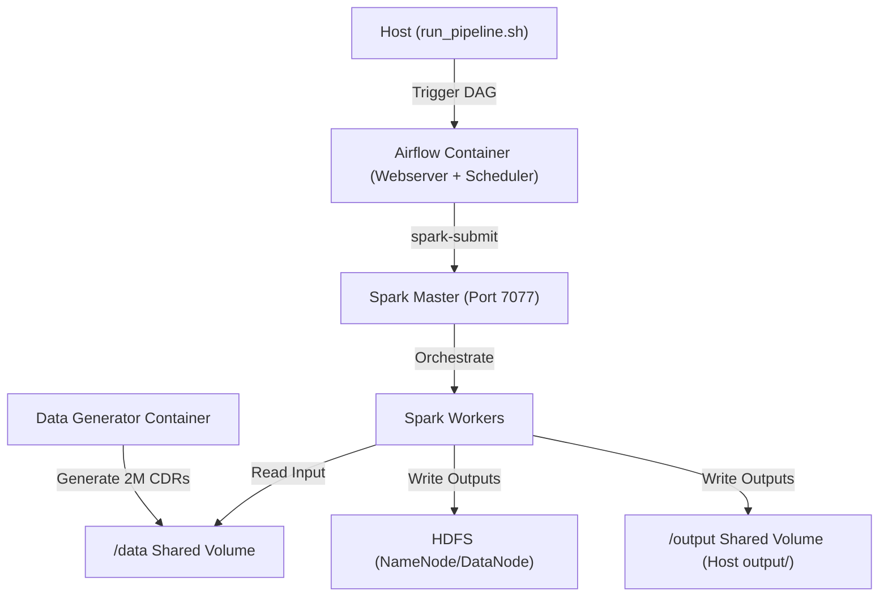

# Hadoop-Based Batch Analytics Pipeline for Call Detail Records (CDRs)

This project implements a containerized, production-style batch analytics pipeline to process Call Detail Records (CDRs) using Apache Spark, Apache Hadoop HDFS, and Apache Airflow. The pipeline is fully orchestratable and automated.

---

## Architecture Overview



The pipeline contains the following services:
*   **Hadoop HDFS NameNode & DataNode**: Provides a distributed, HDFS-compliant storage layer.
*   **Spark Master & Worker**: Executes distributed PySpark batch jobs.
*   **Data Generator**: Simulates a dataset of 2,050,000 CDR rows, injecting a "whale caller" and duration anomalies.
*   **Apache Airflow**: Orchestrates the pipeline, auto-discovering DAGs, submitting jobs, and managing dependencies.

---

## Project Structure

```
project-root/
├── docker-compose.yml          # Service definition and orchestration
├── Dockerfile                  # Custom Airflow image (adds OpenJDK 17 & Spark client)
├── .env.example                # Environment variables configuration template
├── run_pipeline.sh             # Command translation script (Logical query -> Airflow DAG)
├── data/
│   ├── generate_records.sh     # Executable data generator wrapper
│   └── generate_records.py     # Python script to generate 2.05M records
├── jobs/
│   ├── top_callers.py          # PySpark job: Top 100 callers by spend
│   ├── tower_heatmap.py        # PySpark job: Tower hourly utilization heatmap
│   ├── anomalous_calls.py      # PySpark job: Anomalous call detection using custom partitioner
│   └── revenue_recon.py        # PySpark job: Revenue reconciliation
├── dags/
│   ├── top_callers_dag.py      # Airflow DAG for top callers
│   ├── tower_heatmap_dag.py    # Airflow DAG for tower heatmap
│   ├── anomalous_calls_dag.py  # Airflow DAG for anomalous calls
│   └── revenue_recon_dag.py    # Airflow DAG for revenue reconciliation
└── output/                     # Auto-created directory containing execution results
    ├── top_callers_by_spend/
    ├── tower_utilization_heatmap/
    ├── anomalous_call_detection/
    └── revenue_reconciliation/
```

---

## Technical Details

### 1. Data Skew and the Whale Caller
In large-scale telecommunications datasets, a small fraction of users (e.g. call centers, telemarketers) generate a massive fraction of records. This is known as **data skew**. In this project, a single "whale caller" (`caller_whale`) is injected and accounts for exactly 210,000 records (~10.24% of the total 2,050,000 rows). 
A normal hash partitioner would route all of these records to one reducer, creating a massive computing bottleneck (hotspot).

### 2. Custom Partitioner for Anomaly Detection
The anomalous call detection job (`jobs/anomalous_calls.py`) is designed to locate calls whose duration is more than three standard deviations ($> 3\sigma$) away from that specific user's mean duration.
To compute per-user statistics ($\mu$ and $\sigma$), we must route all records for a given `caller_id` to the same partition/reducer.
*   **Implementation**: We convert the PySpark DataFrame into an RDD of key-value pairs (`caller_id`, `row_dict`).
*   **Custom Partitioner**: We apply a custom partitioner (`caller_partitioner`) using an MD5-based hash algorithm:
    $$\text{partition\_index} = \text{int}(\text{MD5}(\text{caller\_id}), 16) \pmod{\text{num\_partitions}}$$
    This guarantees that all records for a single user are grouped together on the same partition.
*   **Processing**: We use `mapPartitions` to process each partition locally, computing caller statistics and filtering anomalies. Since the dataset is processed partition-wise, it prevents memory leaks and ensures scalable, out-of-core operations.

### 3. Execution Manifests
Upon completing a PySpark run, each job generates a JSON metadata file named `_MANIFEST.json` inside its output directory:
```json
{
  "job_name": "anomalous_call_detection",
  "run_id": "20260608_152100",
  "execution_timestamp_utc": "2026-06-08T15:21:05.123456+00:00",
  "input_path": "/data/cdr_data.csv",
  "output_path": "/output/anomalous_call_detection/20260608_152100/",
  "input_record_count": 2050000,
  "output_record_count": 2079,
  "status": "SUCCESS"
}
```
The manifest file is written to BOTH the local file system (under `output/`) and the HDFS directory.

---

## Setup and Execution Instructions

### Prerequisites
*   Docker and Docker Compose installed.
*   Make sure Docker daemon is running.

### Step 1: Initialize Environment
Clone the repository and copy the environment template:
```bash
cp .env.example .env
```

### Step 2: Spin Up Containers
Launch the stack (Hadoop, Spark, Airflow, and Data Generator):
```bash
docker compose up -d --build
```
Verify that all containers report a `healthy` status:
```bash
docker compose ps
```
The data generator container will automatically start generating the `cdr_data.csv` file (~2.05M records). Once the file is generated, the `data-generator` container will report `healthy`, which will trigger the startup of the Airflow container. Airflow will initialize its database, register the DAGs, and report `healthy`.

### Step 3: Run the Analytics Pipeline
Use the query transformation script `./run_pipeline.sh` to trigger jobs. The script will output real-time progress and block until execution completes.

#### 1. Top 100 Callers by Spending
Identify the top 100 callers by total spend (sorted in descending order):
```bash
./run_pipeline.sh top_callers
```
*   **Output**: `/output/top_callers_by_spend/{run_id}/` (Contains CSV file and `_MANIFEST.json`).

#### 2. Cell Tower Hourly Heatmap
Calculate the number of calls handled by each cell tower for each hour of the day (0-23):
```bash
./run_pipeline.sh tower_heatmap
```
*   **Output**: `/output/tower_utilization_heatmap/{run_id}/` (Contains CSV file and `_MANIFEST.json`).

#### 3. Anomalous Call Detection
Locate calls that deviate by more than $3\sigma$ from the caller's mean duration using the custom RDD partitioner:
```bash
./run_pipeline.sh anomalous_calls
```
*   **Output**: `/output/anomalous_call_detection/{run_id}/` (Contains CSV file and `_MANIFEST.json`).

#### 4. Revenue Reconciliation
Sum all charges in the dataset:
```bash
./run_pipeline.sh revenue_recon
```
*   **Output**: `/output/revenue_reconciliation/{run_id}/` (Contains a single-line CSV file representing the total revenue, and `_MANIFEST.json`).

---

## Monitoring and Web Interfaces
*   **Airflow Web UI**: `http://localhost:8080` (Username: `admin`, Password: `admin`)
*   **Spark Master Web UI**: `http://localhost:8081`
*   **Hadoop NameNode UI**: `http://localhost:9870`
